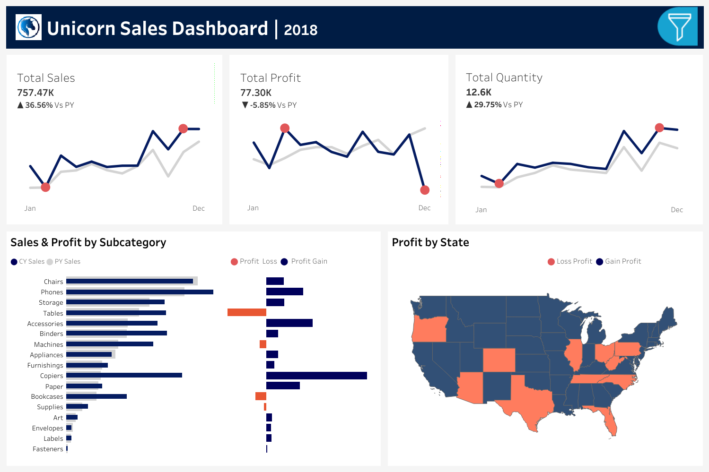

# 📊 Sales Analysis Project

This project presents an end-to-end **Sales Performance Analysis** for 2018, using **spreadsheets, SQL, and Tableau** to explore sales, profit, and quantity trends. The final output is an interactive dashboard built with Tableau.

---

## Tools Used

- **Spreadsheet** (Excel/Google Sheets) – Data cleaning and formatting
- **SQL** – Data extraction, transformation, and analysis
- **Tableau** – Dashboard creation and data visualization

---
## 📈 Dashboard Overview

The dashboard includes:
- **Total Sales, Profit, and Quantity Trends**
- **Sales & Profit Breakdown by Subcategory**
- **Profit Distribution by State**
- **YOY Comparison vs. Previous Year**

🟦 Gain in Profit | 🔴 Loss in Profit

---
## 🔍 Key Insights

- Sales grew by **36.56%** compared to the previous year.
- However, overall profit decreased by **5.85%**.
- Several states and subcategories are operating at a **loss**, needing further investigation.
- Top-performing subcategories include **Phones**, **Chairs**, and **Binders**.

---

## 🛠️ How to Use This Project

1. **Open `sales_data.xlsx`** in Excel or Google Sheets to review the raw data.
2. **Run the SQL script** (`sales_analysis_queries.sql`) using a PostgreSQL/MySQL/SQLite environment.
3. **Open the Tableau workbook** (`sales_dashboard.twbx`) to interact with the visuals.
4. Alternatively, view the static image provided in `/images`.

---

## 📌 Future Improvements

- Connect Tableau directly to SQL for dynamic updates.
- Automate monthly reporting with scheduled extracts.
- Expand analysis to other years and product categories.

---
